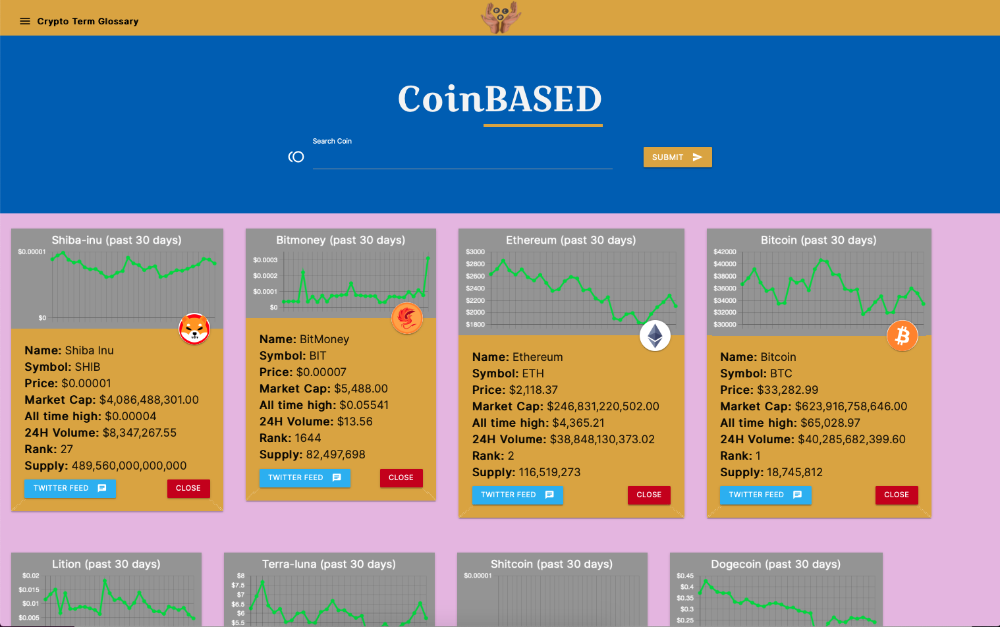

# Crypto CARDS
Project 1 for GT Bootcamp

Created by Robert Perez, Brooks Gunn, and David Ludwik

Entering the name of a currency in the search bar creates an information card containing up-to-date statistics of that assets, including a 30-day price history chart, which is then added to the card display area. The user can add as many cards as they desire and remove them just as easily to curate their ideal array of token information.  The user's card layout is saved whenever a change is made so, upon returning to the application at a later time, their selected cryptocurrencies are automatically displayed and they can stay informed of any changes to the assets they are watching. Each card's 'Twitter Feed' button pulls up a bar on the left containing a selection of recent, relevant tweets from Twitter's API. Additional features include a scrolling ticker of CoinGecko's Top Trending Coins to present the user with new potential currencies to explore, and a glossary of crypto-related terms to assist the user as they explore various assets in the crypto space.

Check it out yourself!

[Link in folder](./index.html)

[Link through github pages](https://worldunfurled.github.io/project-1_RDB/)

Screenshots:

High level technical explanation:

Crypto data for every supported coin is pulled from coinpaprika upon page load and stored in a data object. This is done in order to minimize latency of card creation. Coin icons and price history for the chart data are pulled from the coingecko api. Charts are created by passing the coingecko data into an object made by the chart.js library. Once a coin name is entered, the crypto data object is searched through, and relevant data is then pulled used to populate the crypto card. Each card is dynamically generated and inserted into the parent card-space div. At the same time an array of active coin names is updated to include the new coin, then the array is re-saved in local storage. 

Upon page load the data is pulled from local storage and used to repopulate the array of active coin names, which is then looped through to call the card generating function for each saved coin. The close button action listener triggers removal of the html related to displaying that card, and the coins name is removed from array of active coins.

At the bottom of the page is a horizontal scrolling ticker that displays the top 7 trending coins from coingecko. The ticker functions without and javascript functionality and is made using only HTML and CSS thanks to this guide by Lewis Carey [https://codepen.io/lewismcarey/pen/GJZVoG](https://codepen.io/lewismcarey/pen/GJZVoG).

The tweet-bar action listener triggers one of four actions based on the different combinations of 2 factors: 
    1. is twitter bar already visible
    2. have you clicked on a new coin

currently hidden and current coin --> makes tweet bar visible
currently hidden and new coin --> clear old tweet bar, repopulate tweet bar with new coin, make visible
currently visible and current coin --> makes tweet bar not visible, 
currently visible and new coin --> clear old tweet bar, repopulate tweet bar with new coin

The tweet fetching function takes in the coin name as a parameter, then makes an api call to twitter with the coin name embedded in the link. The generate function is then called which populates each card in the tweet bar from the tweet data from the api data object. The html for each card is dynamically inserted into the tweet-space.

